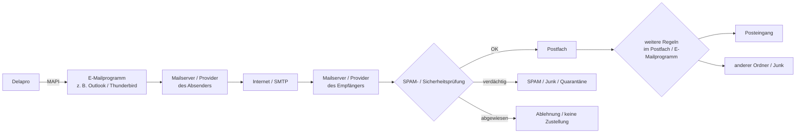
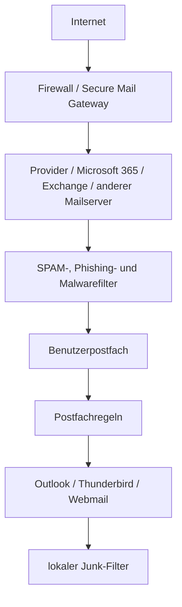
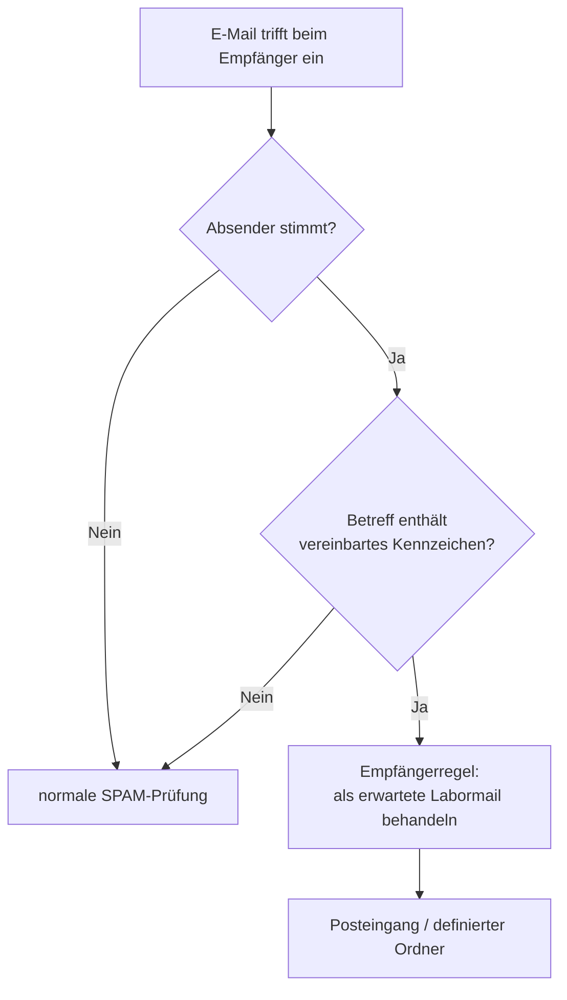
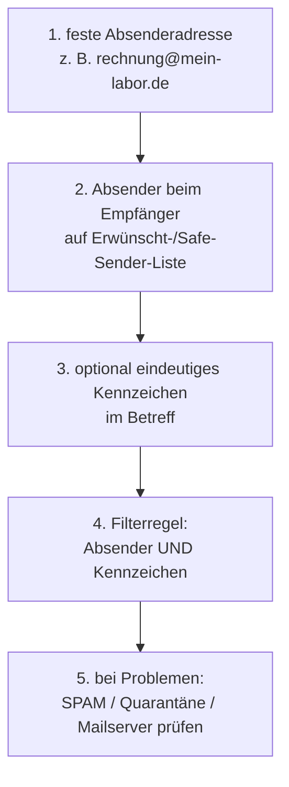
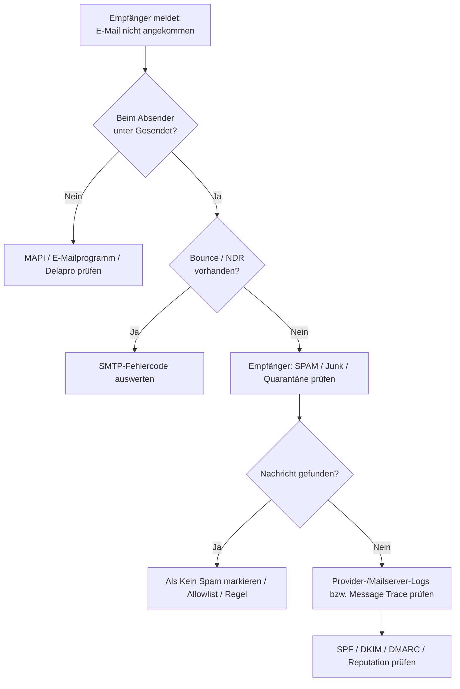
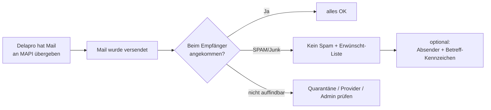

# E-Mail-Zustellung, SPAM und Whitelisting

Beim E-Mailversand aus Delapro wird die Nachricht bei Verwendung von MAPI zunächst an das unter Windows eingerichtete MAPI-fähige E-Mailprogramm übergeben, z. B. Outlook oder Thunderbird.

Eine erfolgreiche Übergabe an das E-Mailprogramm bedeutet noch nicht automatisch, dass die Nachricht auch beim Empfänger im Posteingang landet.

Der eigentliche Versand und die Zustellung erfolgen anschließend über das im E-Mailprogramm eingerichtete E-Mailkonto und die beteiligten Mailserver bzw. E-Mailprovider.



Daher sind zwei grundsätzlich unterschiedliche Fehlerfälle zu unterscheiden:

1. **Delapro kann die E-Mail nicht an das E-Mailprogramm übergeben.**  
   Dann liegt eher ein MAPI-, Outlook-, Thunderbird- oder Windows-Problem vor. Siehe dazu auch [MAPI-Fehler](MAPI-Fehler.md), [Outlook](Outlook.md) und [Thunderbird](Thunderbird.md).

2. **Die E-Mail wurde versendet, kommt beim Empfänger aber nicht oder nur im SPAM-Ordner an.**  
   Dann liegt das Problem normalerweise hinter Delapro, also beim Absender-Mailserver, Empfänger-Mailserver, E-Mailprovider oder einem SPAM-/Sicherheitsfilter.

---

## Für Anwender: Die E-Mail ist beim Empfänger nicht angekommen

Wenn eine aus Delapro versendete Rechnung, Monatsaufstellung oder andere E-Mail beim Empfänger nicht auffindbar ist, sollte zunächst Folgendes geprüft werden:

- Ist die Nachricht beim Absender im Ordner **Gesendet** vorhanden?
- Hat der Absender eine Fehlermeldung oder Rückläufer-E-Mail erhalten?
- Hat der Empfänger im Ordner **SPAM**, **Junk-E-Mail** oder **Unerwünscht** gesucht?
- Gibt es beim Empfänger eine **Quarantäne**?
- Wurde nach der E-Mail-Adresse des Absenders und nach dem Betreff gesucht?
- Kann eine gefundene Nachricht als **Kein Spam** bzw. **Kein Junk** markiert werden?
- Kann die Absenderadresse als **sicherer bzw. erwünschter Absender** hinterlegt werden?

Bei Firmen kann die Quarantäne durch einen Administrator verwaltet werden und für den normalen Benutzer nicht sichtbar sein.

---

# Was bedeutet Whitelisting?

Beim sogenannten **Whitelisting** wird ein bekannter Absender ausdrücklich als erwünscht bzw. vertrauenswürdig eingestuft.

Je nach Anbieter werden dafür unterschiedliche Begriffe verwendet:

- Whitelist
- Allowlist
- Erwünscht-Liste
- Sichere Absender
- Safe Sender
- Zulässige Absender

Beispiel:

```text
rechnung@mein-labor.de
```

wird beim Empfänger als erwünschter Absender eingetragen.

Wenn möglich sollte immer zuerst die **konkrete E-Mail-Adresse** und nicht sofort die komplette Domain freigegeben werden.

Also eher:

```text
rechnung@mein-labor.de
```

als:

```text
mein-labor.de
```

Eine komplette Domain sollte nur dann freigegeben werden, wenn alle Absender dieser Domain vertrauenswürdig sind.

> Whitelisting ist eine gezielte Ausnahme für bekannte Kommunikationspartner. Es ersetzt keine korrekt konfigurierte E-Mail-Infrastruktur.

---

## Es kann mehrere Filter hintereinander geben

Gerade bei Firmen existiert häufig nicht nur ein einziger SPAM-Filter.



Eine Freigabe in Outlook hilft nicht, wenn die Nachricht bereits vorher vom Provider oder Mailserver abgewiesen wurde.

Deshalb gilt:

> Eine Freigabe muss möglichst an der Stelle erfolgen, an der die Nachricht tatsächlich gefiltert wird.

---

# Häufig verwendete E-Mailprovider

Die Menüs der Anbieter können sich ändern. Die folgenden Links führen deshalb möglichst direkt zu den Hilfeseiten der jeweiligen Anbieter.

Stand der Links: 03.09.2026.

## WEB.DE

WEB.DE bezeichnet die Whitelist als **Erwünscht-Liste**.

Eine E-Mail-Adresse oder Domain kann unter den E-Mail-Einstellungen in die Erwünscht-Liste eingetragen werden.

Offizielle Hilfe:

- [WEB.DE: Erwünscht-Liste verwalten](https://hilfe.web.de/email/spam-und-viren/whitelist-verwalten.html)
- [WEB.DE: E-Mail als Spam / Kein Spam markieren](https://hilfe.web.de/email/spam-und-viren/persoenlicher-spamfilter/spamschutz.html)
- [WEB.DE: Filterregeln erstellen](https://hilfe.web.de/email/filterregeln/benutzerdefinierte-filterregeln.html)

WEB.DE unterstützt Filterregeln unter anderem anhand von **Absender**, **Empfänger** und **Betreff**.

---

## GMX

GMX bezeichnet die Whitelist ebenfalls als **Erwünscht-Liste**.

Offizielle Hilfe:

- [GMX: Erwünscht-Liste verwalten](https://hilfe.gmx.net/email/spam-und-viren/whitelist-verwalten.html)
- [GMX: E-Mail als Spam / Kein Spam markieren](https://hilfe.gmx.net/email/spam-und-viren/persoenlicher-spamfilter/spamschutz.html)
- [GMX: Filterregeln erstellen](https://hilfe.gmx.net/email/filterregeln/quickfilter-anlegen.html)

Auch GMX unterstützt Filterregeln anhand von **Absender**, **Empfänger** und **Betreff**.

---

## Telekom / T-Online

Bei Telekom-Mail sollte zunächst auch der eingestellte SPAM-Schutz kontrolliert werden.

Offizielle Hilfe:

- [Telekom: Spam-Filter im E-Mail Center](https://www.telekom.de/hilfe/apps-dienste/e-mail/e-mail-center-spam-filter)
- [Telekom: Filterregeln im E-Mail Center](https://www.telekom.de/hilfe/apps-dienste/e-mail/e-mail-center-filterregeln)

Filterregeln können bei Telekom unter anderem auf einen bestimmten Absender oder auf speziellen Text im Betreff reagieren.

Besonders zu beachten ist, dass die Telekom als SPAM erkannte Nachrichten je nach Einstellung bereits **direkt ablehnen** kann. In diesem Fall erreicht die Nachricht das Postfach gar nicht und eine dort eingerichtete Filterregel kann nicht mehr greifen.

---

## Gmail

Bei Gmail kann für einen bekannten Absender ein Filter erstellt und die Aktion **Nie als Spam einstufen** gewählt werden.

Offizielle Hilfe:

- [Google: Probleme mit legitimen E-Mails im Spamordner beheben](https://support.google.com/mail/answer/16457426?co=GENIE.Platform%3DDesktop&hl=de)
- [Google: Suchoperatoren und Filter](https://support.google.com/mail/answer/7190?co=GENIE.Platform%3DDesktop&hl=de)

Mit Gmail-Suchbedingungen lassen sich z. B. Absender und Betreff kombinieren.

---

## Outlook.com / Microsoft

Outlook.com bietet eine Liste **Sichere Absender und Domänen**.

Offizielle Hilfe:

- [Microsoft: Sichere Absender in Outlook.com](https://support.microsoft.com/de-DE/Outlook/safe-senders-in-outlook-com)
- [Microsoft: Junk-E-Mail und sichere Absender](https://support.microsoft.com/de-DE/Outlook/block-a-mail-sender-in-outlook)
- [Microsoft: Regeln in Outlook](https://support.microsoft.com/de-DE/Outlook/mail/manage-email-messages-by-using-rules-in-outlook)

Bei Microsoft-365-/Exchange-Umgebungen ist zu beachten, dass eine lokale Outlook-Einstellung nicht zwingend einen vorgeschalteten serverseitigen Filter beeinflusst. In Firmenumgebungen sollte deshalb gegebenenfalls der Administrator die serverseitige Filterung bzw. Quarantäne prüfen.

---

# Zusätzliches Kennwort im Betreff?

Praxis und Labor können zusätzlich ein gemeinsames **Erkennungswort** oder **Kennzeichen** vereinbaren, das Delapro in der Betreffzeile ausgibt.

Beispiel:

```text
[DLPR-4711] Rechnung 123456
```

Auf Empfängerseite kann anschließend eine Filterregel eingerichtet werden:

```text
Absender ist:       rechnung@mein-labor.de
UND
Betreff enthält:    [DLPR-4711]
```

Aktion beispielsweise:

```text
in Posteingang verschieben
```

oder – sofern der E-Mailanbieter dies anbietet –

```text
nicht als SPAM behandeln
```

Das ist sinnvoller als nur auf das Kennzeichen zu prüfen.



## Ist das Kennzeichen ein Passwort?

**Nein.**

Ein Betreff-Kennzeichen sollte nicht als Passwort oder Sicherheitsmerkmal betrachtet werden.

Der Betreff einer E-Mail ist für Mailserver, SPAM-Filter, Protokolle und den Empfänger sichtbar. Wer eine entsprechende E-Mail gesehen hat, kennt anschließend auch das Kennzeichen.

Das Kennzeichen ist daher eher mit einer **zusätzlichen Erkennungsmarke** vergleichbar.

Es hilft vor allem dabei, eine Filterregel eindeutiger zu machen:

```text
nur Absender
```

ist weniger spezifisch als:

```text
Absender + Kennzeichen im Betreff
```

## Kennzeichen regelmäßig ändern?

Das ist möglich.

Beispielsweise:

```text
[DLPR-4711]
```

später:

```text
[DLPR-8392]
```

Ein regelmäßiger Wechsel verhindert zumindest, dass ein sehr altes Kennzeichen dauerhaft verwendet wird.

Man sollte daraus aber keinen aufwendigen Passwortwechsel-Prozess machen. In der Praxis dürfte ein Wechsel

- bei Bedarf,
- nach einer Fehlkonfiguration,
- wenn das Kennzeichen unerwünscht bekannt wurde oder
- beispielsweise halbjährlich/jährlich

ausreichen.

Ein monatlicher Wechsel erzeugt wahrscheinlich mehr Verwaltungsaufwand als Nutzen.

Wird ein Kennzeichen geändert, müssen **Delapro-Konfiguration und Empfängerregel gleichzeitig angepasst werden**, sonst werden die Nachrichten nicht mehr von der Regel erkannt.

---

# Empfehlung für Praxis und Labor

Eine robuste Konfiguration könnte folgendermaßen aussehen:



Beispiel:

```text
Absender:
rechnung@mein-labor.de

Betreff:
[DLPR-4711] Monatsaufstellung August 2026
```

Empfängerregel:

```text
Wenn
    Absender = rechnung@mein-labor.de
und
    Betreff enthält [DLPR-4711]

dann
    Nachricht in den Posteingang bzw. einen definierten Labor-Ordner verschieben.
```

> Das Kennzeichen sollte nur als zusätzliche Filterbedingung verwendet werden. Die eigentliche Vertrauensentscheidung sollte möglichst weiterhin auf dem Absender und – bei professionell verwalteten Domains – auf einer korrekten Mailserver-Authentifizierung beruhen.

---

# Für Administratoren

Wenn Nachrichten regelmäßig bei mehreren unterschiedlichen Empfängern im SPAM landen, sollte nicht versucht werden, das Problem ausschließlich durch immer mehr Whitelist-Einträge bei den Empfängern zu lösen.

Dann sollte die Absenderseite geprüft werden.

Insbesondere:

- SPF
- DKIM
- DMARC
- Reputation der Absender-Domain
- Reputation des versendenden Mailservers bzw. der IP-Adresse
- verwendete Envelope-From-/Return-Path-Adresse
- sichtbare From-Adresse
- Dateianhänge und Dateitypen
- enthaltene Links
- Versandmenge und Versandfrequenz

Ein typischer Diagnoseweg:



Für eine Supportanfrage sollten möglichst folgende Angaben vorliegen:

```text
Absender:
Empfänger:
Datum:
ungefähre Uhrzeit:
Betreff:
E-Mailprogramm des Absenders:
E-Mailprovider des Absenders:
E-Mailprovider des Empfängers:
Nachricht unter "Gesendet": Ja/Nein
Fehlermeldung bzw. Bounce vorhanden: Ja/Nein
SPAM-/Junk-Ordner geprüft: Ja/Nein
Quarantäne geprüft: Ja/Nein
```

Bei Zugriff auf Mailserver- oder Provider-Protokolle sind zusätzlich hilfreich:

```text
SMTP Message-ID
Return-Path
SMTP-Statuscode
SPF-Ergebnis
DKIM-Ergebnis
DMARC-Ergebnis
Spam-/SCL-/Score-Wert
Quarantänegrund
```

---

# Kurzfassung



Eine erfolgreiche MAPI-Übergabe sagt nur aus, dass Delapro die Nachricht an das konfigurierte E-Mailprogramm übergeben konnte.

Für die spätere Zustellung sind das E-Mailprogramm, die verwendeten Mailserver, E-Mailprovider und deren Sicherheitsfilter verantwortlich.

**Empfohlene Reihenfolge:**

1. SPAM-/Junk-Ordner prüfen.
2. Nachricht als **Kein Spam** markieren.
3. Absender in die **Erwünscht-/Safe-Sender-Liste** aufnehmen.
4. Optional eine Filterregel aus **Absender + vereinbartem Betreff-Kennzeichen** verwenden.
5. Wenn die Nachricht gar nicht auffindbar ist: Quarantäne und Provider-/Mailserver-Protokolle prüfen.
6. Bei wiederkehrenden Problemen auf Absenderseite SPF, DKIM, DMARC und Reputation prüfen.
