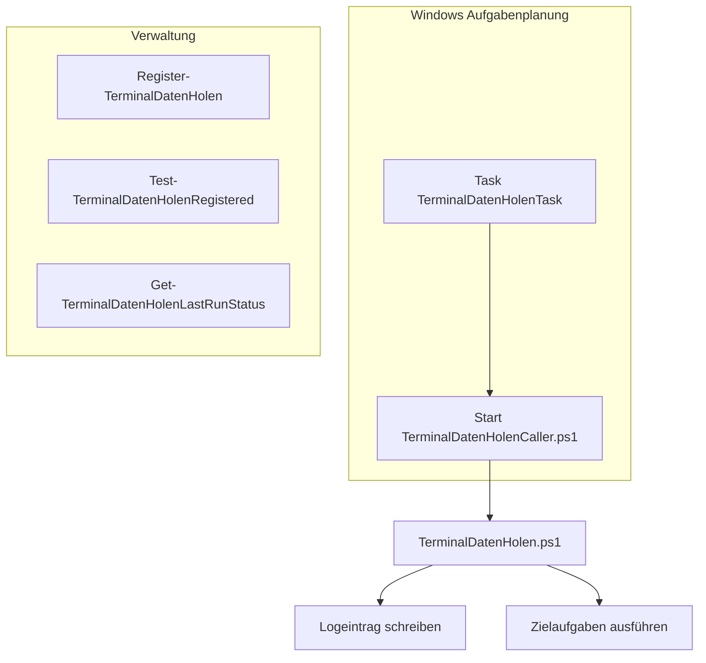

# Zeiterfassung - Daten automatisch vom Terminal holen

Dieses Dokument beschreibt die Einrichtung, damit die Zeitdaten vom Terminal automatisch geholt werden.

## Übersicht

Dazu benötigt werden verschiedene Dateien die über die Aufgabenplanung automatisch aufgerufen werden, dazu gibt es noch Verwaltungsfunktionen um den Status abzufragen oder die Einrichtung vornehmen zu können. Hier eine Übersicht:



## Einrichtung

Pfade in den Skripten müssen evtl. angepasst werden. Bei Netzwerkversion sollten trotzdem die Skripte auf lokale Dateien zugreifen und dann später vor dem eigentlichen Holen der Daten prüfen, ob das Netzlaufwerk verfügbar ist. Wenn nicht sollte abgebrochen werden.

$DLPPath\WEGO\TerminalDatenHolenCaller.ps1
```Powershell
$scriptPath = "C:\Delapro\WEGO\TerminalDatenHolen.ps1"
Start-Process -FilePath "powershell.exe" -ArgumentList "-ExecutionPolicy Bypass -File `"$scriptPath`"" -NoNewWindow
```

$DLPPath\WEGO\TerminalDatenHolen.ps1
```Powershell
$logPath = "C:\Delapro\WEGO\TerminalDatenHolen.log"
$timestamp = Get-Date -Format "dd-MM-yyyy HH:mm:ss"
Add-Content -Path $logPath -Value "$($timestamp): Skript gestartet"
Add-Content -Path $logPath -Value "$($timestamp):   Daten vom Terminal holen"
CALL WEGO2DLP.BAT
Add-Content -Path $logPath -Value "$($timestamp):   Daten neu verbuchen starten"
DLP_TIME /NEUVERBUCHUNG
Add-Content -Path $logPath -Value "$($timestamp):   WMSG.TXT vorbereiten"
DLP_TIME /TECHWEGO
Add-Content -Path $logPath -Value "$($timestamp): Skript beendet"

# Weitere Aufgaben hier...
```

Einrichtungsfunktionen
```Powershell
function Register-TerminalDatenHolen {
    $action = New-ScheduledTaskAction -Execute "powershell.exe" `
              -Argument "-ExecutionPolicy Bypass -File C:\Delapro\WEGO\TerminalDatenHolenCaller.ps1"
    $trigger = New-ScheduledTaskTrigger -Daily -At 3am
    $trigger.DaysOfWeek = "Monday", "Tuesday", "Wednesday", "Thursday", "Friday"

    Register-ScheduledTask -TaskName "TerminalDatenHolenTask" -TaskPath '\easy\' `
        -Action $action -Trigger $trigger -User "$env:USERNAME" -RunLevel LeastPrivilege
}
```

Verwaltungsfunktionen
```Powershell
function Test-TerminalDatenHolenRegistered {
    $task = Get-ScheduledTask -TaskName "TerminalDatenHolenTask" -TaskPath '\easy\' -ErrorAction SilentlyContinue
    return $null -ne $task
}


function Get-TerminalDatenHolenLastRunStatus {
    $events = Get-WinEvent -LogName Microsoft-Windows-TaskScheduler/Operational `
        | Where-Object { $_.Message -like "*TerminalDatenHolenTask*" } `
        | Select-Object -First 1
    return $events
}
```
